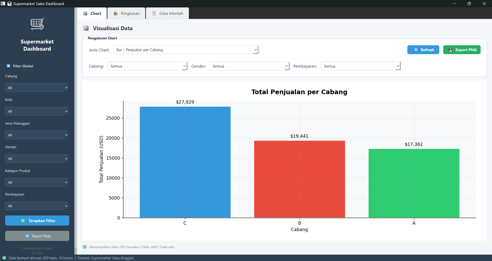

# Supermarket Sales Dashboard

Aplikasi dashboard untuk memvisualisasikan data supermarket sales dari kaggle.

---

## Struktur Proyek

```
supermarket_dashboard/
│
├── main.py                  
│
├── data/
│   └── supermarket_sales.csv 
│
├── ui/
│   ├── __init__.py
│   ├── main_window.py     
│   ├── summary_widget.py  
│   ├── table_widget.py   
│   └── chart_widget.py   
│
├── utils/
    ├── __init__.py
    └── data_loader.py      
```

---

## Jenis Chart yang Tersedia

1. **Bar** – Total penjualan per cabang
2. **Bar Horizontal** – Produk terlaris per kategori
3. **Line** – Tren penjualan harian
4. **Pie** – Distribusi metode pembayaran
5. **Pie** – Distribusi jenis pelanggan
6. **Scatter** – Harga satuan vs jumlah pembelian
7. **Histogram** – Distribusi rating pelanggan
8. **Box Plot** – Distribusi total transaksi per kategori

---

## Teknologi

- **PySide6** – GUI framework
- **Matplotlib** – Visualisasi chart
- **Pandas** – Manipulasi data
- **NumPy** – Komputasi numerik

---

## Screenshot

